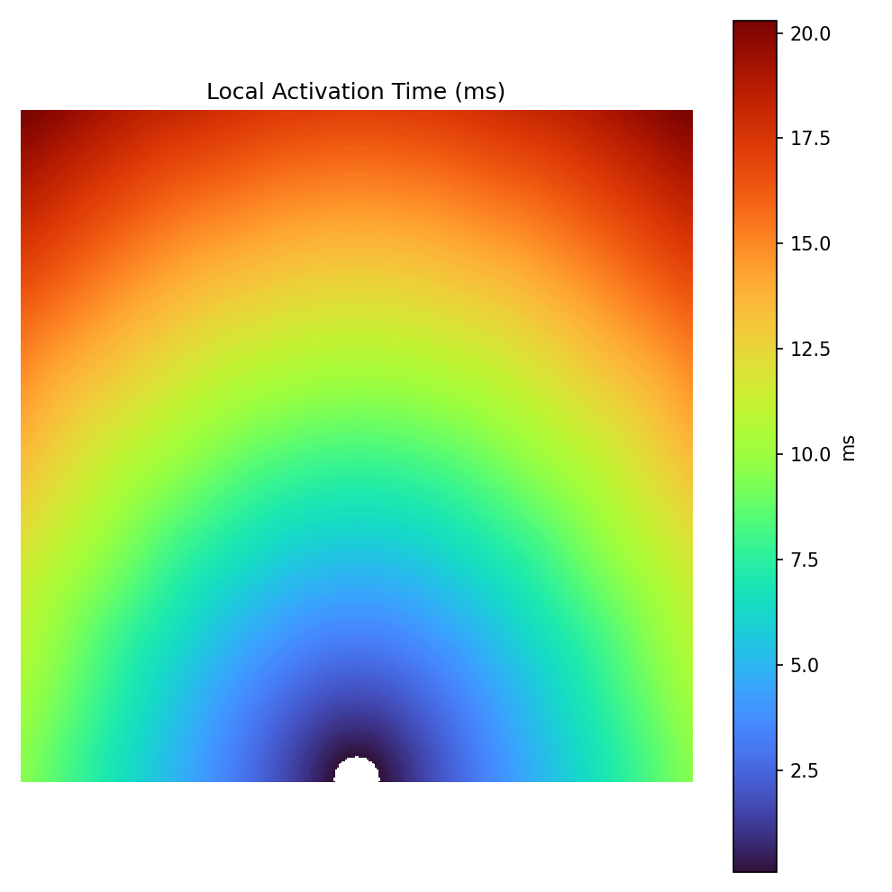

# 🫀 Cardiac Propagation Cellular Automaton

This project simulates **2‑D cardiac excitation wave propagation** using a **hybrid cellular automaton** model.  
It combines:

- **Integer states** for excitation/refractory progression
- **Floating‑point voltage accumulator (`V`)** that integrates neighborhood input
- **Anisotropic Gaussian kernel** to model preferred conduction direction and anisotropy

The result is a smooth, realistic simulation of cardiac wavefronts, with tools to measure **Local Activation Time (LAT)** and **Conduction Velocity (CV)**.

---

## 📸 Example Output

**Local Activation Time (LAT) Map Example:**



---

## ✨ Features

- **Hybrid CA model** with anisotropic conduction
- Adjustable **fiber orientation** and **anisotropy ratio**
- Multiple **stimulus patterns** (`center`, `bottom_center`, `bottom_cap`)
- **LAT tracking** and **CV estimation** tools
- **Real-time animation** with `matplotlib`
- Automatic **screenshots** at chosen simulation steps
- **Data collection** for activity summaries

---

## ⚙️ Requirements

- Python **3.8+**
- NumPy
- Matplotlib
- SciPy

Install dependencies:

```bash
pip install numpy matplotlib scipy
```
---

## 🛠 Configuration

You can tweak simulation parameters at the top of the script:

| Parameter              | Description |
|------------------------|-------------|
| `GRID_SIZE`            | Grid width/height in pixels |
| `DX_MM` / `DT_MS`      | Spatial & temporal resolution |
| `REFRACTORY_STEPS`     | Refractory period length |
| `ANISO_RATIO`          | Anisotropy ratio (longitudinal / transverse) |
| `FIBER_ANGLE_DEG`      | Fiber orientation in degrees |
| `THETA`                | Excitation threshold |
| `ALPHA`                | Voltage leak factor |
| `EXCITED_STAGES`       | Number of excited substates |

---